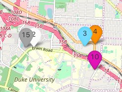
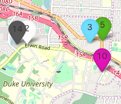

# Project-Cheese_Slicer and Chopsticks

## Overview of the Project

This repository contains the app and relevant materials we produced during the fall 2017 STA523 class project with me and 3 other students in Duke Statsci.

The final product of this project is an housing search app exclusively for apartments nearby Duke campus (in Durham area) built on Shiny.

It builds up on my previous work contained in **https://github.com/Jantg/Housing_rankings** repository with improved Bayesian modeling approach and end product as a Shiny app.
 
## App URL:

**https://jantg.shinyapps.io/housing_rankings_hierarchical_liner_reg/**
 
##  Features:
	
**General Feature**

Once you click the icon, a pop up with the picture of the apartment will show up (if available), and the url to that specific aparment review page on apartment.com is embedded in the apartment name at the top of the pop-up.

Additionally, when the user zoom in/out, the ranking will dynamically change assuming that the user is only interested in ranking apartments within that view range.

**GUI based Features**

Top 5- Top15: It allows the user to pick whether they want top 5, top 10 or top 15 apartments.

Price Range, Distance, Floor plan: Self explanatory features.

Estimate Preference: Whether the user is concerned about the underestimating the ratings (pessimistic), or overestimating it (optimistic) or neutral. For example consider the following snapshot from the app:
	

Both snapshots are obtained by switching the top15 apartments from the starting view-range with maximum rent above 800 and distance below 8 miles with 1B-1B floor plan. The only difference is whether the estimate preference is pessimistic (above) or neutral (below).

If we actually take a look at the reviews of these apartments (by clicking the apartment name in the pop-up embedded in the icon), we will notice the stark difference in the number of reviews which makes the ratings of the one with few reviews uncertain while in comparison to the other with a lot of it. Thus, when we adopt pessimistic estimate preference, the increased penalty to the uncertainty have strong preference to those with more reviews, thus changing the order of some apartments as captured by these figures above.

## Model Description & Rationales of this approach (in case if you are interested)

We used several group and individual measurements as predictors to model ratings of apartments with Hiearchical Ordered Multinomial Logistic Regression.

It produces posterior distribution of apartment ratings ranging from 0-5 stars. Compared to optimization based approach (most machine learning algorithms) that only yields point estimate of ratings (rather than distribution as in our case), this approach has one crucial advantage: it takes into account the uncertainty in these ratings which could significantly differ among apartments due to number of reviews etc.

To clarify what I mean by including uncertainty, let's simplify the problem and consider the case where we are modeling whether the apartment is considered good/bad (binary outcome) using upvote/downwote as a proxy outcome for that (so not even regression). Suppose we are only interested ranking 2 apartments, and somehow managed to obtain the posterior distribution of these apartments being upvoted as $p_1\in[0,1],p_2\in[0,1]$ and these distributions are as follows:
	
	
	
As we can see, it is not immediatly apparent which apartments are better by looking at the distributions. In order to rank them, easiest approach is to obtain a representative value from these 2 distributions by picking one point of the distribution. The most strainghtforward choice of such a point is mean, however we could also be conservative and pick the 1-st quantile if we want to lower the chance of overestimating the upvote for some reason. Resulting point estimates for distributions of both apartments are shown below:
	
	
	
As we can see, the resulting rankings are completely opposite depending on our choice of representative values used for evaluation. Whether we prefer one ranking from another depends on your decision rule. If you simply care about the efficiency of the ranking, picking some centrality measure such as mean, median mode etc would be better. However, if you are particularly concerned about the over or under-estimate, evaluating at the center doesn't make any sense, and would rather care about the tails of the distribution.

A Bayesian approach that returns the whole distribution can do this comparison in one go, while a point-estimate based approach has to specify what the point estimate you are looking for to predict (like whether the regression type should be a mean-regression or quantile-regression) and compare as in the above case. Also, designing a more conplicated measurement to rank based on these distributions can also be done easily by this Bayesian approach.
